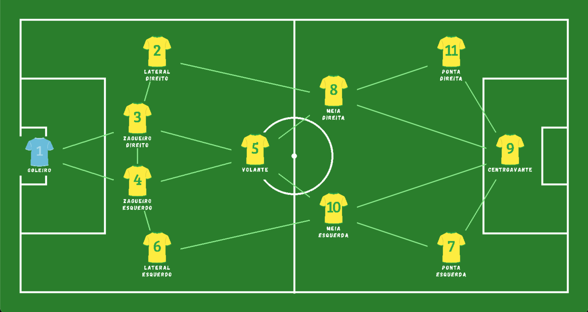
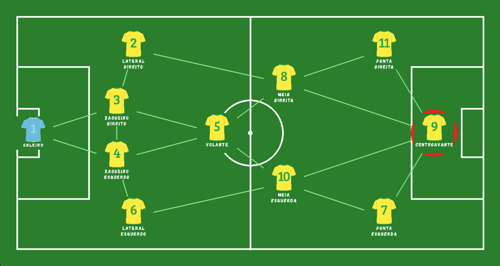
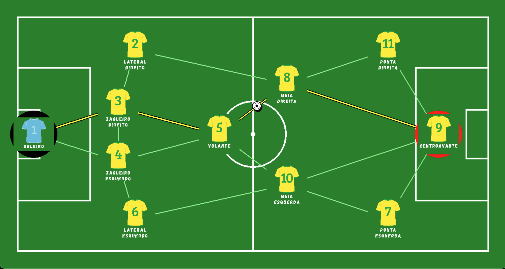

# Partida de futebol ⚽️🏟️

Número da Lista: 53<br>
Conteúdo da Disciplina: Grafos<br>

## 👥 Equipe

| Perfil | Matrícula | Aluno |
| :---: | :---: | :--- |
| <a href="https://github.com/Maliz30"></a> | `211063210` | **Maria Alice Bernardo da Costa Silva** <br> [@Maliz30](https://github.com/Maliz30) |
| <a href="https://github.com/MilenaBaruc"></a> | `211062339` | **Milena Baruc Rodrigues Morais** <br> [@MilenaBaruc](https://github.com/MilenaBaruc) |

## ℹ️ Sobre 
O projeto tem como objetivo exibir o funcionamento do algoritmo **Dijkstra**, que realiza a busca do menor caminho em um grafo ponderado.

O cenário desenvolvido se baseia em uma formação tática de futebol. No sistema, cada jogador representa um **nó** e as possibilidades de passe são as **arestas**. Os pesos das arestas são calculados dinamicamente com base na distância euclidiana entre os jogadores no campo. O simulador permite que o usuário visualize como a bola percorreria o caminho mais eficiente (mais curto) entre dois atletas escolhidos.


## 🖼️ Screenshots

Ao rodar o projeto com o comando:

``bash
python3 mapa.py
``

irá aparecer a tela de todos os jogadores como mostra na imagem abaixo.

<div align="center">


*Imagem 1 - Tela dos Jogadores*

</div>

O primeiro passo é selecionar o jogador que irá começar com a bola, como é mostrado na imagem abaixo.

<div align="center">


*Imagem 2 - Ao selecionar o começo da jogada*

</div>

O próximo passo é definir o destino da bola. O sistema então calcula e exibe o menor caminho para que ela chegue mais rapidamente, conforme ilustrado abaixo.
<div align="center">


*Imagem 3 - Ao selecionar onde a bola deve chegar*

</div>

## 🎥 Video
[](Link_do_Video_ou_Arquivo)

## 🛠️ Instalação 
Linguagem: Python 3<br>
Biblioteca Gráfica: Pygame

```bash
python3 -m venv venv
source venv/bin/activate  # Linux/Mac
# .\venv\Scripts\Activate.ps1 # Windows
pip install -r requirements.txt
```

### ⚙️ Pré-requisitos
- **Ter o Python instalado**:
  - **Windows:** Baixe e instale pelo [site oficial (python.org)](https://www.python.org/downloads/) ou pela Microsoft Store. Confirme se a opção "Add Python to PATH" foi marcada na instalação.
  - **Linux (Ubuntu/Debian):** Rode `sudo apt update && sudo apt install python3 python3-venv` no terminal.
  - **Mac:** Utilize o instalador oficial ou rode `brew install python` caso utilize o Homebrew.

## 🎮 Como Usar 
1. Execute o comando: `python mapa.py` (ou `python3 mapa.py`)
2. **Selecionar Origem**: Clique no jogador que está com a posse de bola.
3. **Selecionar Destino**: Clique no jogador para quem deseja realizar o passe final.
4. **Visualizar**: O sistema destacará o caminho de passes que minimiza a distância total percorrida pela bola.
